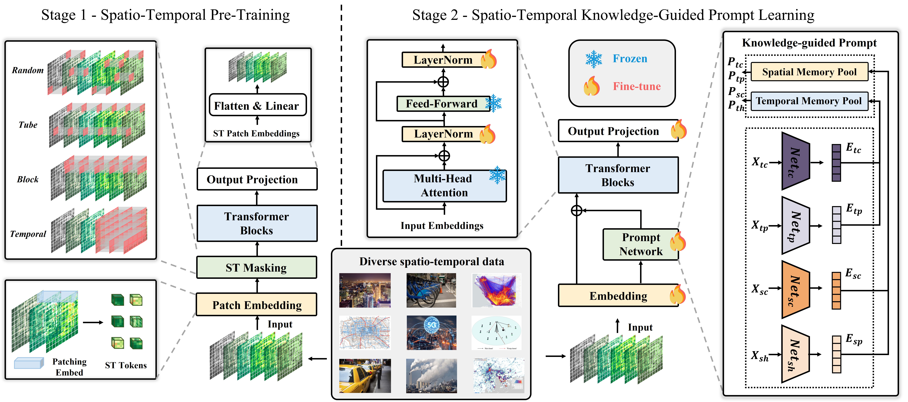
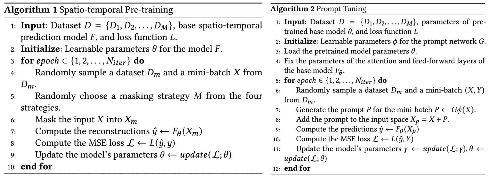

# UniST

A pytorch implementation for the paper: [**UniST: A Prompt-Empowered Universal Model for Urban Spatio-Temporal Prediction**](https://arxiv.org/abs/2402.11838).

[Yuan Yuan](https://scholar.google.com/citations?user=1AaWLJ8AAAAJ), [Jingtao Ding](https://scholar.google.com/citations?user=_TAJECAAAAAJ), [Jie Feng](https://scholar.google.com/citations?user=uvLx-GAAAAAJ), [Depeng Jin](), [Yong Li](https://scholar.google.com/citations?user=kmgzPeQAAAAJ)

**[FIBLAB](https://fi.ee.tsinghua.edu.cn/)@[Tsinghua University](https://www.tsinghua.edu.cn/)**

-----

The repo currently includes code implementations for the following tasks:

> **Short-term Prediction**: We provide all scripts  for the reproduction of short-term prediction results in this repo.

> **Long-term Prediction**: We provide all scripts  for the reproduction of long-term prediction results in this repo.

> **Few-shot Prediction**: UniST can generalize well to scenarios with limited training data, making it to be data-efficient.

> **Zero-shot Prediction**: UniST is demonstrated to generalize well on unseen spatio-temporal scenarios, making it a nice alternative as the fundamental backbone of the foundation spatio-temporal model.


## 🎉 Updates

📢: **News** (2024.06) Introduction of our work in [Chinese](https://mp.weixin.qq.com/s/4rxmEx-8cYfgWHX6ct9gag) is available.

📢: **News** (2024.05) UniST has been accepted to **KDD 2024**.


## Introduction
🏆 By capturing the  underlying commonalities across multiple spatio-temporal scenarios, UniST breaks the  conventional practice that train separate models for different datasets, and has demonstrated superior performance and powerful generalization capability across diverse urban scenarios.


## Overall Architecture
🌟 The training of UniST consists of two stages: (i) large-scale spatio-temporal pre-training, and (ii) spatio-temporal knowledge-guided prompt tuning. 


The pseudo-code of UniST is as simple as the following:


## ⚖ Foundation models for spatio-temporal prediction

| Model  | Data Format | Data Scalability | Few-shot | Zero-shot | Computation Cost | Memory Cost |
|--------|-------------|------------------|----------|-----------|------------------|-------------|
| PromptST [1] | Grid | **✗** | **✗** | **✗** | Low | Low |
| GPT-ST [2]   | Graph | **✗** | **✗** | **✗** | Low | Low |
| STEP [3]    | Graph |  **✗** | **✗** | **✗** | Low | Low |
| ST-SSL [4]   | Graph |  **✗** | **✗** | **✗** | Low | Low |
| TrafficBERT [5] | Grid/Graph  |  **✓** | **✗** | **✗** | Low | Low |
| TFM [6]    | Graph | **✗** | **✗** | **✗** | Low | Low |
| UrbanGPT [7]     | Grid | **✓**<sup>(a)</sup>  | **✓**<sup>(a)</sup> | **✓**<sup>(a)</sup> | High | High |
| STG-LLM [8]    | Graph | **✗**  | **✗** | **✗** | High | High |
| UniST | Grid/Graph | **✓**  | **✓** | **✓** | Low | Low |

<sub>**(a). Still restricted in the same city.**</sub><br>

[1] [PromptST: Prompt-Enhanced Spatio-Temporal Multi-Attribute Prediction](https://arxiv.org/abs/2309.09500), CIKM 2023

[2] [GPT-ST: Generative Pre-Training of Spatio-Temporal Graph Neural Networks](https://proceedings.neurips.cc/paper_files/paper/2023/file/de7858e3e7f9f0f7b2c7bfdc86f6d928-Paper-Conference.pdf), NIPS 2023

[3] [Pre-training enhanced spatial-temporal graph neural network for multivariate time series forecasting](https://dl.acm.org/doi/10.1145/3534678.3539396), KDD 2022

[4] [Spatio-Temporal Self-Supervised Learning for Traffic Flow Prediction](https://dl.acm.org/doi/10.1609/aaai.v37i4.25555), AAAI 2023

[5] [TrafficBERT: Pre-trained model with large-scale data for long-range traffic flow forecasting](), Expert Systems with Applications

[6] [Building transportation foundation model via generative graph transformer](https://www.sciencedirect.com/science/article/pii/S0957417421011179), ITSC 2023

[7] [UrbanGPT: Spatio-Temporal Large Language Models](https://arxiv.org/abs/2403.00813), KDD 2024

[8] [How can large language models understand spatial-temporal data?](https://arxiv.org/abs/2401.14192), arXiv 2024

## Data
We use multiple datasets to demonstrate the UniST, which span various cities and domains. To access the datasets, please refer to [data readme](https://github.com/tsinghua-fib-lab/UniST/blob/main/dataset/README.md).


## ⚙️ Installation
### Environment
- Tested OS: Linux
- Python >= 3.9
- torch == 2.0.0
- Tensorboard

### Dependencies:
1. Install Pytorch with the correct CUDA version.
2. Use the `pip install -r requirements.txt` command to install all of the Python modules and packages used in this project.

## 🏃 Model Training

Please first navigate to the `src` directory by using the cd command: `cd src`

Then please create a folder named `experiments` to record the training process: `mkdir experiments`

### Stage-1: Pre-training
We provide the scripts under the folder `./scripts/pretrain.sh`. You can train UniST with the Cellular dataset as the following examples:

```python
python main.py --device_id 3 --machine machine  --dataset Crowd --task short --size middle  --mask_strategy_random 'batch' --lr 3e-4 --used_data 'single'  --prompt_ST 0
```

Once your model is trained, you will find the logs recording the training process in the  `./logs/` directory. The folder will be named as the `Pretrain_Dataset_<dataset>_task_<task>`. In the `./experiments/Pretrain_Dataset_<dataset>_task_<task>/model_save/`, you will find the trained model named `model_best.pkl`.

In our experiments, we leverage multiple datasets to enhance UniST. 
If you need to use multiple datasets, please use an asterisk (*) to separate the datasets, *e.g.*, `--dataset Crowd*Cellular*TaxiNYC*TaxiBike*TrafficSH`.

### Stage-2: Prompt-tuning
We provide the scripts under the folder `./scripts/prompt_tuning.sh`. You can fine-tune UniST with the Cellular dataset as the following examples:

```python
python main.py --device_id 2 --machine machine --task short --size middle   --prompt_ST 1  --pred_len 6 --his_len 6  -num_memory_spatial 512 --num_memory_temporal 512  --prompt_content 's_p_c'  --dataset Crowd    --lr 3e-4 --used_data 'single' --file_load_path  pretrained_model_path
```

There are some new parameters to specify:

- `his_len` specifies the input sequence length.
- `pred_len` specifies the prediction horizon.
- `file_load_path` specifies the save path of the pre-trained model, the default is `./experiments/Dataset_<dataset>_task_<task>/model_save/model_best.pkl`
- `num_memory_spatial` and `num_memory_temporal` specify the number of embeddings in the memory pools.
- `prompt_ST` specifies whether perform prompt-tuning: 0 for no prompt and 1 for prompt-tuning.
- `prompt_content` specifies the type of prompt, which can be selected from ['s_p_c','s','c','p','s_c','s_p','p_c'].

Once your model is trained, you will find the logs recording the training process in the  `./logs/` directory. The folder will be named as the `Prompt_Dataset_<dataset>_His_<his_len>_Pred_<pred_len>`. In the `./experiments/Prompt_Dataset_<dataset>_His_<his_len>_Pred_<pred_len>/model_save/`, you will find the fine-tuned model named `model_best.pkl`.

The evaluation results of the testing set can be obtained from `./experiments/Prompt_Mode_finetuning_Dataset_<dataset>_His_<his_len>_Pred_<pred_len>/result.txt`.

## Model Weights
We provide downloads of model weights on xxx. Coming soon.

## 👀 Citation

If you find this repo helpful, please cite our paper. 

```latex
@article{yuan2024unist,
  title={UniST: A Prompt-Empowered Universal Model for Urban Spatio-Temporal Prediction},
  author={Yuan, Yuan and Ding, Jingtao and Feng, Jie and Jin, Depeng and Li, Yong},
  journal={arXiv preprint arXiv:2402.11838},
  year={2024}
}
```

## 🙇‍ Acknowledgement
We appreciate the following GitHub repos a lot for their valuable code and efforts.
- Spatio-temporal prediction benchmark: [https://github.com/chengtan9907/OpenSTL](https://github.com/chengtan9907/OpenSTL)
- Spatio-temporal data: [https://github.com/aptx1231/NYC-Dataset](https://github.com/aptx1231/NYC-Dataset)
- MAE: [https://github.com/facebookresearch/mae](https://github.com/facebookresearch/mae)
- PatchTST: [https://github.com/PatchTST/PatchTST](https://github.com/PatchTST/PatchTST)
- iTransformer: [https://github.com/thuml/iTransformer](https://github.com/thuml/iTransformer)

## 📧 Contact

If you have any questions or want to use the code, feel free to contact:
* Yuan Yuan (y-yuan20@mails.tsinghua.edu.cn)
