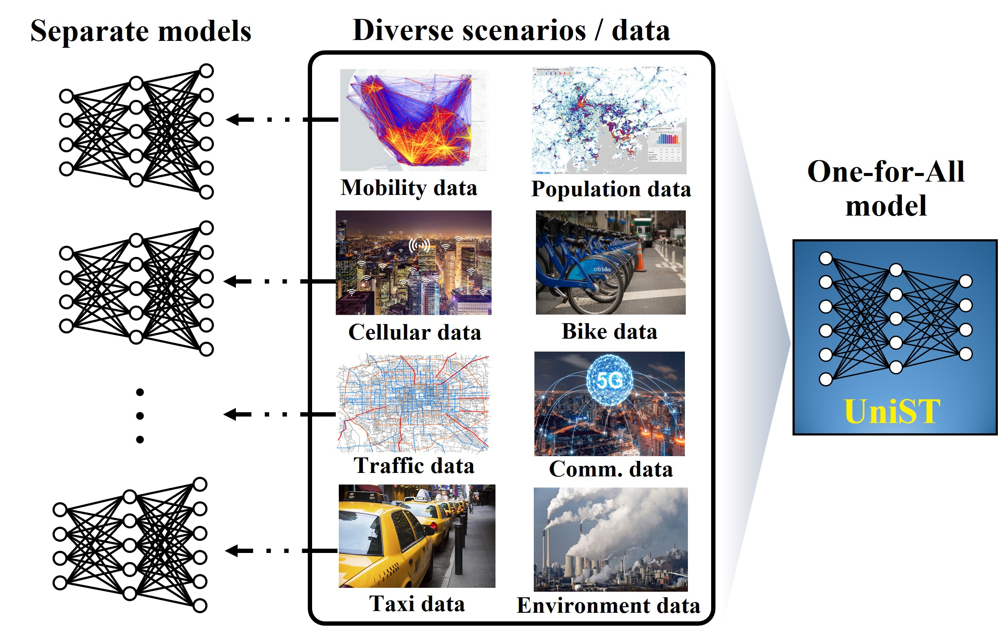

# UniST
### The repo is the official implementation for  our KDD submission: 
### UniST: A Prompt-Empowered Universal Model for Urban Spatio-Temporal Prediction

It includes code implementations for the following tasks:

- **Short-term Prediction**: We provide all scripts  for the reproduction of short-term prediction results in this repo.
- **Long-term Prediction**: We provide all scripts  for the reproduction of long-term prediction results in this repo.
- **Few-shot Prediction**: UniST can generalize well to scenarios with limited training data, making it to be data-efficient.
- **Zero-shot Prediction**: UniST is demonstrated to generalize well on unseen spatio-temporal scenarios, making it a nice alternative as the fundamental backbone of the foundation spatio-temporal model.

## Introduction
🌟 By capturing the  underlying commonalities across multiple spatio-temporal scenarios, UniST breaks the  conventional practice that train separate models for different datasets, and has demonstrated superior performance and powerful generalization capability across diverse urban scenarios.

## Overall Architecture
The training of UniST consists of two stages: (i) large-scale spatio-temporal pre-training, and (ii) spatio-temporal knowledge-guided prompt tuning. 

The pseudo-code of UniST is as simple as the following:

## Data
We use multiple datasets to demonstrate the UniST, which span various cities and domains. To access the datasets, please refer to [data readme](https://github.com/YuanYuan98/UniST/blob/main/dataset/README.md).

## Installation
### Environment
- Tested OS: Linux
- Python >= 3.9
- torch == 2.0.0
- Tensorboard

### Dependencies:
1. Install Pytorch with the correct CUDA version.
2. Use the ``pip install -r requirements.txt`` command to install all of the Python modules and packages used in this project.

## Model Training

Please first navigate to the ``src`` directory by using the cd command:

``cd src``

Then please create a folder named ``experiments`` to record the training process:

``mkdir experiments``

### Stage-1: Pre-training
We provide the scripts under the folder ``./scripts/pretrain.sh``. You can train UniST with the Cellular dataset as the following examples:

``
python main.py --device_id 2 --machine your_machine_name --batch_size 256 --dataset Cellular --task short --lr_anneal_steps 500 --size middle  --lr 3e-4 --used_data 'all' 
``

Once your model is trained, you will find the logs recording the training process in the  ``./logs/`` directory. The folder will be named as the ``Dataset_<dataset>_task_<task>``. In the ``./experiments/Dataset_<dataset>_task_<task>/model_save/``, you will find the trained model named ``model_best.pkl``.

In our experiments, we leverage multiple datasets to enhance UniST. 
If you need to use multiple datasets, please use an asterisk (*) to separate the datasets.

``
--dataset multiple_datasets
``

For example, ``multiple_datasets`` can be  ``Crowd*Cellular*TaxiNYC*TaxiBike*TrafficSH``.

### Stage-2: Prompt-tuning
We provide the scripts under the folder ``./scripts/prompt_tuning.sh``. You can fine-tune UniST with the Cellular dataset as the following examples:

``
python main_prompt.py --device_id 2 --machine machine --task short   --his_len 6 --pred_len 6 --dataset Cellular --file_load_path  pretrained_model_path  --num_memory_spatial 512 --num_memory_temporal 512   --prompt_content 's_p_c'  --lr2 5e-5
``

There are some new parameters to specify:

- ``his_len`` specifies the input sequence length.
- ``pred_len`` specifies the prediction horizon.
- ``file_load_path`` specifies the save path of the pre-trained model, the default is ``./experiments/Dataset_<dataset>_task_<task>/model_save/model_best.pkl``
- ``num_memory_spatial`` and ``num_memory_temporal`` specify the number of embeddings in the memory pools.
- ``prompt_content`` specifies the type of prompt, which can be selected from ['s_p_c','s','c','p','s_c','s_p','p_c'].

Once your model is trained, you will find the logs recording the training process in the  ``./logs/`` directory. The folder will be named as the ``Prompt_Mode_finetuning_Dataset_<dataset>_His_<his_len>_Pred_<pred_len>``. In the ``./experiments/Prompt_Mode_finetuning_Dataset_<dataset>_His_<his_len>_Pred_<pred_len>/model_save/``, you will find the fine-tuned model named ``model_best.pkl``.

The evaluation results of the testing set can be obtained from ``./experiments/Prompt_Mode_finetuning_Dataset_<dataset>_His_<his_len>_Pred_<pred_len>/result.txt``.

## Acknowledgement
We appreciate the following GitHub repos a lot for their valuable code and efforts.
- Spatio-temporal prediction benchmark: [https://github.com/chengtan9907/OpenSTL](https://github.com/chengtan9907/OpenSTL)
- Spatio-temporal data: [https://github.com/aptx1231/NYC-Dataset](https://github.com/aptx1231/NYC-Dataset)
- MAE: [https://github.com/facebookresearch/mae](https://github.com/facebookresearch/mae)
- PatchTST: [https://github.com/PatchTST/PatchTST](https://github.com/PatchTST/PatchTST)
- iTransformer: [https://github.com/thuml/iTransformer](https://github.com/thuml/iTransformer)
